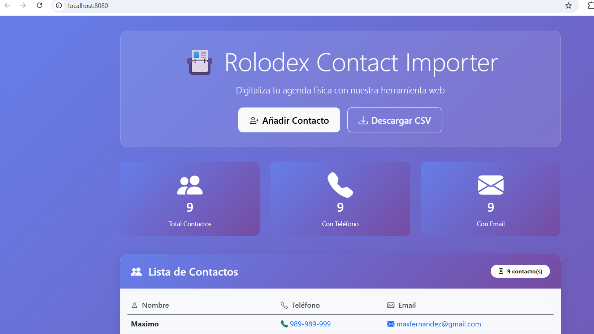

# 🚀 Guía de Instalación y Puesta en Marcha



## 📋 Descripción del Proyecto

**Rolodex Contact Importer** es una aplicación para digitalizar contactos físicos de tipo Rolodex a formato CSV. Incluye versiones web y CLI (línea de comandos).

---

## ✅ Requisitos Previos

Antes de comenzar, asegúrate de tener instalado:

- **PHP 8.0 o superior** (en este caso se usó PHP 8.2.12)
- **Composer 2.x** (gestor de dependencias de PHP)
- Sistema operativo: Windows, Linux o macOS

### Verificar instalación:

```powershell
# Verificar PHP
php --version

# Verificar Composer
composer --version
```

---

## 🔧 Pasos para Poner en Marcha el Proyecto

### **Paso 1: Clonar o Descargar el Proyecto**

Si estás leyendo esto, probablemente ya tienes el proyecto descargado. La estructura debe verse así:

```
rolodex-importer/
├── app/
│   ├── Controllers/
│   │   └── Contacts.php
│   └── Views/
│       └── contacts/
├── writable/
│   └── contacts.csv
├── public/
│   └── index.php
├── index.php
├── contact-importer.php
├── composer.json
└── README.md
```

---

### **Paso 2: Instalar Dependencias con Composer**

Abre una terminal en la raíz del proyecto y ejecuta:

```powershell
composer install
```

**⚠️ Nota sobre errores de ZIP:**
Si ves advertencias sobre extensión ZIP faltante, no te preocupes. Composer descargará las dependencias desde el código fuente automáticamente.

**Resultado esperado:**
- Se creará la carpeta `vendor/` con las siguientes librerías:
  - `codeigniter4/framework`
  - `laminas/laminas-escaper`
  - `psr/log`

---

### **Paso 3: Verificar la Carpeta Writable**

La carpeta `writable/` debe tener permisos de escritura para que la aplicación pueda guardar el archivo CSV.

```powershell
# En Windows, los permisos generalmente están bien por defecto
# En Linux/Mac, ejecuta:
chmod -R 755 writable/
```

---

### **Paso 4: Iniciar el Servidor Web**

Tienes **dos opciones** para ejecutar la aplicación:

#### **Opción A: Versión Web Simple (Recomendada)**

Esta versión NO requiere CodeIgniter completo y funciona de inmediato:

```powershell
php -S localhost:8080
```

Luego abre tu navegador en:
```
http://localhost:8080/index.php
```

#### **Opción B: Versión Web con CodeIgniter**

Si prefieres usar la versión completa de CodeIgniter (requiere más configuración):

```powershell
php -S localhost:8080 -t public
```

Luego abre tu navegador en:
```
http://localhost:8080
```

**⚠️ Problema conocido:** Si ves errores como `Class "CodeIgniter\Autoloader\FileLocator" not found`, usa la **Opción A** en su lugar.

---

### **Paso 5: Usar la Aplicación**

#### **🌐 Versión Web**

1. Abre el navegador en `http://localhost:8080` o `http://localhost:8080/index.php`
2. Verás una interfaz moderna con:
   - **Estadísticas** de contactos (total, con teléfono, con email)
   - **Lista de contactos** existentes
   - **Formulario** para añadir nuevos contactos
3. Rellena el formulario:
   - **Nombre Completo** (obligatorio)
   - **Teléfono** (opcional)
   - **Email** (opcional)
4. Haz clic en **"Guardar Contacto"**
5. El contacto se guardará en `writable/contacts.csv`

#### **💻 Versión CLI (Línea de Comandos)**

Abre una terminal nueva y ejecuta:

```powershell
php contact-importer.php
```

**Uso interactivo:**

```
===========================================
  Rolodex Contact Importer
===========================================

Enter contact information from your physical Rolodex.
Type "exit" or "quit" at the Name prompt to finish.

CSV file initialized: writable/contacts.csv

-------------------------------------------
Full Name: Juan Pérez
Phone Number: 555-123-4567
Email Address: juan@ejemplo.com
✓ Contact saved successfully!

-------------------------------------------
Full Name: exit

Import session completed. Total contacts added: 1
CSV file location: writable/contacts.csv
```

---

## 📊 Verificar los Datos

### Ver el archivo CSV generado:

```powershell
# Ver contenido del CSV
Get-Content writable\contacts.csv

# O abrirlo con Excel
start writable\contacts.csv
```

**Formato del CSV:**

```csv
Name,Phone,Email
Juan Pérez,555-123-4567,juan@ejemplo.com
María García,555-987-6543,maria@ejemplo.com
```

---

## 🛠️ Solución de Problemas

### ❌ Error: "Class CodeIgniter\Autoloader\FileLocator not found"

**Solución:** Usa la versión web simple:
```powershell
php -S localhost:8080
# Y accede a: http://localhost:8080/index.php
```

### ❌ Error: "Permission denied" al guardar CSV

**Solución:** Verifica permisos de la carpeta `writable/`:
```powershell
# Windows: Propiedades > Seguridad > Permitir escritura
# Linux/Mac:
chmod -R 777 writable/
```

### ❌ Error: "Composer command not found"

**Solución:** Instala Composer desde [getcomposer.org](https://getcomposer.org)

### ❌ El servidor no inicia

**Solución:** Verifica que el puerto 8080 no esté ocupado:
```powershell
# Cambiar a otro puerto
php -S localhost:9000
```

---

## 🎯 Características Implementadas

✅ Interfaz web moderna con Bootstrap 5  
✅ Versión CLI interactiva  
✅ Almacenamiento en CSV  
✅ Validación de datos (nombre obligatorio, email válido)  
✅ Estadísticas de contactos  
✅ Descarga de CSV  
✅ Compatibilidad con múltiples sesiones  
✅ Diseño responsive (móvil y escritorio)  

---

## 📁 Estructura de Archivos Importantes

```
📁 Proyecto
├── 📄 index.php              # Versión web simple (standalone)
├── 📄 contact-importer.php   # Versión CLI
├── 📄 composer.json          # Dependencias del proyecto
├── 📁 app/
│   ├── 📁 Controllers/
│   │   └── Contacts.php      # Controlador CodeIgniter (v. completa)
│   └── 📁 Views/
│       └── 📁 contacts/      # Vistas CodeIgniter
├── 📁 public/
│   └── 📄 index.php          # Entry point CodeIgniter
├── 📁 writable/
│   └── 📄 contacts.csv       # ⭐ Archivo CSV generado
└── 📁 vendor/                # Dependencias de Composer
```

---

## 🚀 Resumen Rápido (Quick Start)

```powershell
# 1. Instalar dependencias
composer install

# 2. Iniciar servidor
php -S localhost:8080

# 3. Abrir navegador
http://localhost:8080/index.php

# O usar CLI:
php contact-importer.php
```

---

## 📝 Notas Adicionales

- **Ambas versiones** (web y CLI) usan el mismo archivo CSV: `writable/contacts.csv`
- Los datos se **añaden** al archivo, no se sobrescriben
- El formato CSV es compatible con Excel, Google Contacts, Outlook, etc.
- La versión web incluye formateo automático de números de teléfono
- El nombre es el **único campo obligatorio**

---

## 👨‍💻 Autor

Proyecto creado como parte de un ejercicio de importación de contactos Rolodex.

---

## 📄 Licencia

MIT License - Puedes usar, modificar y distribuir libremente este proyecto.

---

## 🆘 Soporte

Si encuentras problemas:

1. Revisa la sección **"Solución de Problemas"** arriba
2. Verifica los requisitos previos
3. Asegúrate de estar en la raíz del proyecto al ejecutar comandos
4. Consulta los archivos `README.md`, `QUICKSTART.md` y `SETUP.md` para más información

---

**¡Listo! 🎉 Ahora puedes digitalizar tus contactos físicos fácilmente.**
